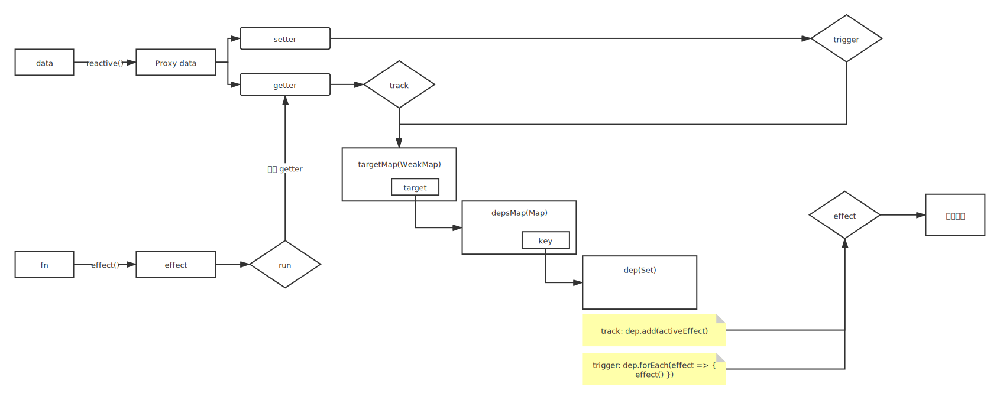

1. Vue 3.0 性能提升主要是通过哪几个方面体现的

   - 响应式系统升级
   - 编译优化
   - 源码体积的优化
     - Vue.js 3.0 中移除了一些不常用的 API
       - 例如：`inline-template`、`filter` 等
     - `Tree-shaking`

2. Vue 3.0 所采用的 Composition Api 和 Vue 2.x 使用的 Options Api 有什么区别

   - Options API
     - 包含一个描述组件选项（data、methods、props 等）的对象
     - Options Api 开发复杂组件，同一个功能逻辑的代码被拆分到不同选项
   - Composition API
     - Vue.js 3.0 新增的一组 API
     - 一组基于函数的 API
     - 可以更灵活的组织组件的逻辑

3. Proxy 相对于 Object.defineProperty 有哪些优点

   - 可以监听动态新增的属性
   - 可以监听删除的属性
   - 可以监听数组的索引和 length 属性

4. Vue 3.0 在编译方面有哪些优化

   - Vue.js 2.x 中通过标记静态根节点，优化 diff 的过程
   - Vue.js 3.0 中标记和提升所有的静态根节点，diff 时只需要对比动态节点内容
     - `Fragments` （升级 vetur 插件）
     - 静态提升
     - `Patch flag`
     - 缓存事件处理函数

5. Vue.js 3.0 响应式系统的实现原理

   